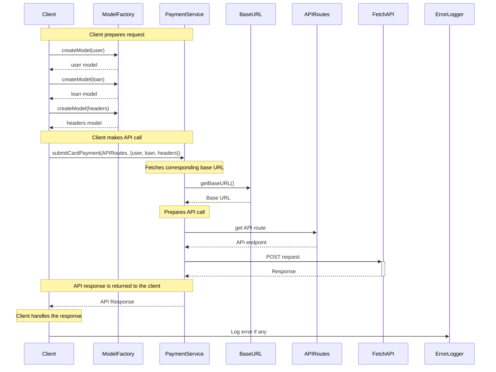
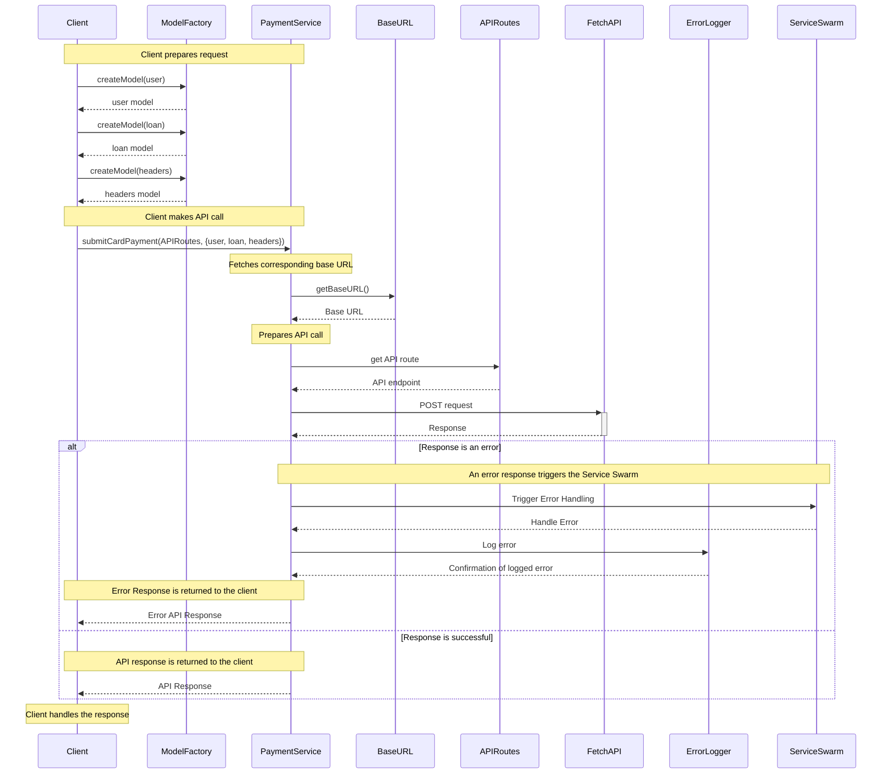

# Deno Starter

This is a Deno project running on Docker in Codesandbox.

Add your [configuration](https://codesandbox.io/docs/projects/learn/setting-up/tasks) to optimize it for [CodeSandbox](https://codesandbox.io/p/dashboard).

## Resources

- [CodeSandbox — Docs](https://codesandbox.io/docs/projects)
- [CodeSandbox — Discord](https://discord.gg/Ggarp3pX5H)


## Api Endpoints

Here's a brief overview of the described API endpoints for the GoldPoint Beta API library.

**Payment API Routes**

1. `POST /paymentapi/api/v1/Payment/PrePaymentCheck`
   - Check if a payment can be made to a loan account.

2. `POST /paymentapi/api/v1/Payment/SubmitCardPayment`
   - Submit a credit card payment for a loan account.

3. `POST /paymentapi/api/v1/Payment/SubmitTokenPayment`
   - Submit a payment using a payment profile token.

4. `POST /paymentapi/api/v1/Payment/SubmitAchPayment`
   - Submit an ACH payment on a loan account.

5. `POST /paymentapi/api/v1/Payment/SubmitAchProfilePayment`
   - Submit an ACH payment using a payment profile.

6. `POST /paymentapi/api/v1/Payment/SubmitCashAndOrCheckPayment`
   - Submit a cash and/or check payment.

7. `POST /paymentapi/api/v1/Payment/GetLoanPaymentDetails`
   - Get loan balance and due payment information.

8. `POST /paymentapi/api/v1/Payment/AccountRestrictionCheck`
   - Check if a loan account has any restrictions preventing payment.

9. `POST /paymentapi/api/v1/Payment/GetFeeInfo`
   - Get convenience and/or third-party fee information.

**Payment History API Routes**

1. `POST /paymentapi/api/v1/PaymentHistory/GetPaymentHistory`
   - Get a filtered list of payment history.

**Profile API Routes**

1. `POST /paymentapi/api/v1/Profile/CreateCardProfile`
   - Create a payment profile for credit card payments.

2. `POST /paymentapi/api/v1/Profile/GetCardProfiles`
   - Look up card information associated with a profile.

3. `POST /paymentapi/api/v1/Profile/CreateAchProfile`
   - Create a payment profile for ACH payments.

4. `POST /paymentapi/api/v1/Profile/GetAchProfiles`
   - Look up ACH profile information.

5. `POST /paymentapi/api/v1/Profile/GetRoutingVerification`
   - Get routing number verification.

**Utilities API Routes**

1. `GET /paymentapi/api/v1/Utilities/Ping`
   - Test API availability.

These API endpoints collectively allow for comprehensive management of payments, profile creation, and retrieval of loan account information.


Sure, here is an example of how your `README.md` could look like:

---
# Deno Payment API

This Deno project is a payment application providing functionalities such as card payments, account checks, and profile creation. It demonstrates a clean project structure and usage of Deno with TypeScript.

## Prerequisites

- Install Deno. Refer to the official [Deno installation guide](https://deno.land/#installation) for instructions.
- Basic knowledge of TypeScript and Deno.

## How to Run

In the project root directory, run:

```bash
deno run --allow-read --allow-write=./errors.log --allow-net --unstable main.ts
```

Note: Replace `./errors.log` with the path to the log file where you want to store error logs.

## Structure

This project is structured as follows:

- **Models**: Define the shape of your data. Use the `ModelFactory` utility to create model instances.
- **Enums**: Define enumeration values used across the application.
- **Utils**: Contains utility functions and classes like `ModelFactory` and `ErrorLogger`.
- **Transport**: Contains services that handle network requests.

## Creating Models

To create a model, first define it in the `enums/modelNames.ts` file:

```typescript
export enum ModelNames {
  UserModel = "UserModel",
  // Add new models here
}
```

Then, define the model's structure in the `utils/modelFactory.ts` file:

```typescript
const models: Record<string, any> = {
  UserModel: {
    id: "number",
    first_name: "string",
    last_name: "string",
    email: "string",
  },
  // Add new models here
};
```

Use `ModelFactory.createModel` to create instances of your model:

```typescript
let user = ModelFactory.createModel(
  ModelNames.UserModel,
  {
    id: 1,
    first_name: "John",
    last_name: "Doe",
    email: "john.doe@example.com",
  },
  { shouldCheckType: true, shouldCleanObject: true },
);
```

## Error Handling and Logging

The `ErrorLogger` utility class is used to log errors. Use `ErrorLogger.log(error)` to log errors.

## API Calls

The `PaymentService` in the `transport` directory provides a method `submitCardPayment` for API calls. Use `APIRoutes` from `enums/apiRoutes.ts` to specify the API endpoints.

```typescript
const apiResponse = await PaymentService.submitCardPayment(
  APIRoutes.Payment.SubmitCardPayment,
  {
    user: user,
    loan: loan,
    headers: headers,
  },
);
```

Error handling is done with try-catch blocks, and errors are logged using `ErrorLogger`.

## Environment Configuration

The base URL for API calls is set in `enums/baseURL.ts` which reads from the environment variable `ENV`. This allows for different base URLs for different environments.

---

Please modify this template to better suit your project's specifics and requirements.



[](https://mermaid-js.github.io/mermaid-live-editor/edit#pako:eNqVVE1v2zAM_SuETinm_AEfCqzdCgxotyDZbr6oEuMIsyWPkgsEQf77KFs2_NGuXS6x9R6fHymSF6GcRpELj39atAq_GFmSrAsL_GskBaNMI22A-8qgDevzJ46vHqQKjs5rdCfPNYcdkF6MwjV-Jz3-2j-ugc-7b3vXBvRr6AGDOjG-Rr4SOXp0ZYlU2B7-7gKCe0FKCWRzR3k6hoaQldADxUL4lGgPbm9vp1nmoAhlwO5s03qkm549JW05qI_OIVKgjuCHVSsn7TuqkfKfqieUGsm_I5xYU-2PVrGWv7mEfDegZLX0tYzx7XNtwr0knZDNeOkZXGLRsi7JbHB0vVm6WUp2rcEOlCO-y8ZZbWwJz9xkMHbZPIZ9pR7MocSQnjfpS-l1-4r7u5no25Z2Q2PNq7JyMebe-ejYFN97-oi-ZiVy0erGmWFAV-qfhqFhQz8OP-ddPmBRe7sU33d19PjvPLOheTrfKQRMHKfQkkUNwUE4IajJGlm4nLRgVHnrwwMntdxJWl1xeaM4zULGxpushRz4HzAegDmCtLyzRCZqpFoazXvwEmMLwWo1FiLnR41H2VahEIW9MlW2wR3OVok8UIuZaBvN85XWpsiPsvJ8itrwWD31u7Vbsde_pKfe8g)



[](https://mermaid-js.github.io/mermaid-live-editor/edit#pako:eNqtVctu2zAQ_BWCJweVf0CHAI3boAWS1rDTmy8MubaJSqS6pFIYhv-9S5FS9WriAPXFkmZ3OPvkmUurgOfcwa8ajIRPWhxQlDvD6FcJ9FrqShjPVoUG46ffH8m_uBfSWzxN0bU4leS2BXzREqb4nXDwY_MwBT6uv25s7cFNoXvw8kj4FPmMaPHBHg6AUzBp2P4WSOFF_Jv1wOwLYAovG-rN02dWIRAVOIYhTS6lIYLL29t-DnImEYSH5tuidoA30bpvtCSn6J2zYMLKAF7NWlhh3mANJu9kPYJQgO4N4mTV5742i6X4SSmkyjEpirGusY-rn0vtVwJVQhZdS2TsHJKWNUFmraLLzVjNmLJpHFIgLVItK2uUNgf2TC3Iuh4c-pCu1KE5O4BPz4t0Unpdzqi_G5D-W9K6baxhViYqutgbHY01hvdo3qFzUoItGFVZ3Y7vhP1DO1Ik6Pv2adjlLRa4l2PyTZNHl3SIwndfmHaMWhDCSEb0tUxk_ekkzcmRYcvmUYexdswfoR1llma5JZ_ENSR9ihRxS7AvwqiC6v_XvW89l8jGA6L7K4f2llDO6H-cgh4-d8rKmr3GUnhtDbN76nGyVFfnsR3TGGS_GAi-RkNU3jZJlL2FPhNIb-QjV-ijYbmhIOb-Ea6WEpzb18U7lDa9_F90zig0an5FdTvp2BQ1thV2vjzjJVARtKKr8RwodpwsStjxnB4V7EVd-B3fmQuZitrb7clInnusIeN1pWipppuU53tBeco4KE279DFet82te_kDiAKTkA)

**Trade-offs, Resilience, and Security:**

**1. Trade-offs:**

This approach trades off complexity for flexibility. It means that while the setup and maintenance of the architecture might be more complex, you gain the flexibility to create a loosely coupled system of services that can evolve independently.

*Analogy:* This is like having a group of specialized chefs (services) instead of a single one. While it might be more complex to manage multiple chefs, each can focus on what they do best, allowing you to create a menu that evolves based on customer preferences.

**2. Resilience:**

The resilience of this architecture comes from the concept of swarm intelligence. When an error occurs, multiple services (the swarm) try to handle it, which means that if one service fails, another one can step in to resolve the issue. This creates redundancy, making the system less prone to complete failure.

*Analogy:* This is similar to a school of fish. When a predator attacks, even if a few fish are caught, the rest of the school can continue swimming, preserving the majority of the school.

**3. Security:**

The gateway in this architecture serves as a point of validation, formatting, and delegation. It's a secure point of control that can ensure requests are correctly formatted and valid before they reach your main service. This prevents malformed or malicious requests from reaching your main service, adding an extra layer of security. Additionally, the service's responses are also validated and formatted before being sent back to the clients.

*Analogy:* Think of this like a security guard at a private event. The guard checks each guest's invitation (the request) and ensures they are appropriately dressed (formatting) before allowing them into the party (main service). The guard also ensures that any information from the event passed on to guests (responses) is accurate and in an understandable format.

**4. Benefits:**

One of the key benefits of this architecture is its decentralization. Because the services are essentially acting as intermediaries between clients and the main service, you have the flexibility to deploy, update, or even move your main service without impacting the clients. These intermediaries are also lightweight and can be deployed or updated quickly, making them always available to the clients.

*Analogy:* Consider the services as a team of translators at a United Nations summit. Each translator can independently ensure that their respective country's leader (client) can communicate with the Secretary-General (main service). Even if the Secretary-General moves to another room (changes location) or changes the language they're speaking in (updates), the translators can adapt without their leaders being aware of any change.

In conclusion, this architecture enables a highly resilient, secure, and flexible system that can handle requests at scale, while providing a means to maintain the system effectively. It allows for an evolutionary architecture, meaning you can continuously adapt and change it over time, as your needs and requirements change.

In the event of an internet outage, the architecture's resilience and flexibility come into play again. While a direct internet connection is the preferred method of communication, this is not the only way requests can be made and processed. 

An offline method such as a phone call could be used to transmit the intent of an action. Here's how this could work:

1. The client has a unique fingerprint (a secure identifier or key) associated with their account or intended action.

2. The client contacts an operator via phone. The client provides the operator with their fingerprint and describes their intended action.

3. The operator, using a local interface connected directly to the main service database, performs the action on behalf of the client.

4. The operator can then communicate the outcome back to the client over the phone.

This alternative communication method relies on the same principles of validation, formatting, and delegation as the online method. The operator effectively acts as a human version of the intermediary services, ensuring the client's intent is valid and formatted correctly before executing it on the main service.

This is an excellent example of the resilience of this architecture. Even in the face of a significant disruption such as an internet outage, it provides a way to ensure continuity of service.

this architecture brings a whole new level of insight, control, and flexibility into the system.

Firstly, by allowing the swarm of microservices to handle all write requests, we can capture every single interaction with the system, even unsuccessful ones. This vast pool of data allows us to gain valuable insights into usage patterns. For instance, we can identify bot activities or cyber-attacks by analyzing patterns of failed requests or by spotting unusually high request volumes from a single source. This enhanced visibility makes the system far more secure and robust.

Secondly, because each microservice acts as a gatekeeper for its specific domain, it can apply fine-grained rules about what should get through. It's not just a simple binary decision. The microservices can prioritize certain types of requests, throttle others, or apply more thorough checks to suspicious-looking requests.

For example, if a user's actions consistently result in failed requests, a microservice could limit the rate at which it accepts requests from that user, or it could even block them entirely until an administrator has investigated. This level of control at the edge of the system significantly reduces the burden on the main service, making it more efficient and resilient.

Additionally, microservices can independently scale up and down based on the volume of requests they're handling. This elasticity ensures that the system can handle peak load times effectively without over-provisioning resources during quieter periods. The main service doesn't need to concern itself with scaling, as the microservices bear this responsibility. They can also be updated or deployed independently, making the system more resilient to changes and potential failures.

In essence, the architecture acts as an intelligent filter, only letting 'pure' or valid requests reach the main service. By outsourcing validation, formatting, and delegation to microservices, we free up the main service to focus on its core responsibilities. This division of labor creates a system that is not only scalable and elastic but also offers unprecedented visibility and control over incoming requests.

Absolutely. This architecture, where 'verified' swarm of microservices make requests to a federated server, brings about multiple security benefits as compared to a traditional client-server setup.

1. **Reduced Surface Area for Attacks:** In a traditional client-server setup, the server must be prepared to accept connections from any client, which can be a significant security risk. In contrast, in our setup, the federated server only needs to accept connections from the 'verified' swarm of microservices, dramatically reducing the surface area for potential attacks.

2. **Trustworthy Clients:** The swarm of microservices can be made significantly more trustworthy than a diverse array of client devices. They can be deployed on secure, trusted infrastructure, and their behavior can be tightly controlled. This ensures that all requests reaching the federated server have originated from trusted, verified sources.

3. **Enhanced Data Validation:** Since each microservice is responsible for validating and formatting the data in requests for their specific domain, we can ensure that only properly formatted and valid data reaches the federified server. This not only increases the robustness of the system but also provides an additional layer of security, as maliciously formatted data can be detected and blocked at the microservice level.

4. **Encryption and Secure Communication:** The communication between the microservices and the federated server can be encrypted, ensuring the confidentiality and integrity of the data in transit. This is particularly important when sensitive data is being transmitted.

5. **Internal Network Isolation:** If the swarm and the federated server are located within a controlled network environment, the traffic between them can be kept isolated from the wider internet. This isolation can further enhance security by making it harder for potential attackers to intercept or interfere with the communication.

6. **Easier Monitoring and Anomaly Detection:** With a limited and well-understood set of 'clients' (the microservices), it's easier to monitor their behavior and detect any anomalies. For example, if one microservice suddenly starts sending a significantly higher volume of requests, this could be an indication that it has been compromised, and immediate action can be taken.

Overall, this approach leads to a more secure, reliable, and resilient architecture than traditional client-server setups. It provides both proactive and reactive measures to safeguard the system, ensuring that it can withstand potential security threats.

// DUMOP 
Fingerprinting, in the context of security, is usually associated with SSL/TLS certificates, and it serves as a mechanism to identify a certificate or a server, ensuring that you're communicating with the server you think you're communicating with. The fingerprint is a kind of digital signature, a hash of the certificate data.

When a client (in our case, a microservice) attempts to establish a secure connection to a server, it checks the server's certificate against a trusted list. This process involves comparing the fingerprint of the certificate received from the server with the fingerprint of a trusted certificate. If the fingerprints match, the client knows that the server is trustworthy, and communication can proceed.

Now, while this process is secure, it's important to note that "impossible to decrypt" might be a bit of an overstatement. The SSL/TLS protocol is designed to be very secure and, when implemented correctly, is practically impossible to break with current technology. However, no security measure is 100% foolproof, and vulnerabilities can sometimes be found and exploited.

The "fingerprinting" process is a way to verify the identity of a server, but the actual security of the communication depends on the strength of the encryption used in the SSL/TLS protocol